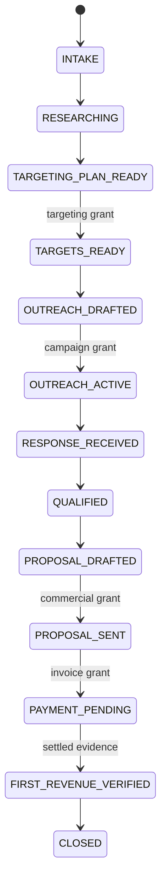

# Governed Revenue Operator System Specification

## Decision

Build the AI employee as an independent governed control plane around products
such as DiffWall. Do not place sales authority, prospect data, provider
credentials, or commercial state inside a product's enforcement runtime.

The first proof is a deterministic, connector-free vertical slice. Live
connectors remain blocked until separate human gates are satisfied.

## Mission and measurable outcome

Given:

- an owner-approved product;
- an evidence-backed offer and claim boundary;
- a bounded target-market policy;
- approved channels, recipients, cadence, and commercial limits;

the system may autonomously perform permitted internal work and execute only
actions covered by active authority grants until one settled revenue event is
verified.

Success requires:

1. every material action has an intent, policy decision, and receipt;
2. no external action occurs without deterministic `ALLOW`;
3. no grant can cross project, action, recipient, value, or expiry scope;
4. first revenue is backed by settled provider or bank evidence;
5. a run can be paused, revoked, replayed, and audited;
6. no agent approves its own action.

## Scope

### In scope

- project intake and commercial objective;
- claim and evidence inventory;
- offer and audience planning;
- public-source research;
- target qualification after targeting approval;
- message and follow-up drafting;
- bounded outreach after campaign approval;
- response triage and qualification;
- proposal and invoice drafting;
- bounded proposal and invoice delivery after approval;
- read-only payment verification;
- decision receipts, telemetry, and exception handling.

### Explicitly out of scope

- autonomous contract signature or acceptance;
- transferring, refunding, or spending money;
- deceptive identity, impersonation, or fabricated evidence;
- scraping or contacting targets outside approved sources and terms;
- bypassing anti-spam, platform, privacy, or rate-limit controls;
- storing raw secrets in prompts or logs;
- customer claims, certification claims, or revenue claims without evidence;
- destructive deletion;
- unattended public broadcast;
- production use in the current increment.

## Actors and authority

| Actor | May do | May not do |
|---|---|---|
| Human owner | Define objectives, issue/revoke grants, approve claims/terms, handle exceptions | Delegate legal or financial accountability to the model |
| Chief-of-staff agent | Plan, decompose, route, monitor, and propose actions | Execute provider actions directly or issue approvals |
| Specialist agents | Research, score, draft, summarize, and recommend | Expand scope, bypass policy, or approve outputs |
| Policy engine | Route typed action intents using versioned rules and grants | Generate business content or infer missing authority |
| Capability broker | Recheck and execute an allowed action idempotently | Execute `REVIEW`, `HALT`, expired, mismatched, or replayed intents |
| Connector worker | Perform one provider-specific operation | Select its own target, policy, or credentials |
| Ledger | Append evidence, decisions, transitions, receipts, and supersession | Mutate prior records silently |

## Autonomy classes

| Class | Examples | Default |
|---|---|---|
| Automated | Read approved public sources, analyze repository, score lead evidence, draft material, update internal state | `ALLOW` if data and source policy pass |
| Human-approved automation | Identify scoped targets, send outreach, schedule follow-up, send proposals, issue invoices | `REVIEW` until an active authority grant matches |
| Human-executed | Sign contracts, accept terms, transfer/refund funds, resolve legal/privacy exceptions | `HALT` for the agent |
| Advisory | Pricing changes, discounts, claims, channel expansion, new audience or connector | Produce recommendation and request review |

## Core components

### Orchestrator

Maintains the workflow state, selects the next eligible task, and pauses on
missing evidence or authority. It never calls a provider directly.

### Agent pool

- Project analyst: reads the product, evidence, maturity, and claim boundaries.
- Market researcher: collects approved public evidence and candidate segments.
- Qualification operator: scores fit, authority, need, timing, and disqualifiers.
- Messaging operator: drafts personalized messages within approved claims.
- Sales operator: drafts responses, proposals, follow-ups, and invoice requests.
- Compliance monitor: checks privacy, claims, channel rules, grant scope, and
  anomalies.

Agents output typed proposals. They do not output permission.

### Deterministic policy engine

Inputs:

- action intent;
- project policy version;
- data classification;
- active approval grants;
- target and financial bounds;
- connector capability;
- current run state.

Output:

- `ALLOW`, `REVIEW`, or `HALT`;
- reason codes;
- matched grant;
- policy version;
- required next gate.

### Approval service

An approval is a signed, expiring authority lease with:

- project;
- permitted action types;
- allowed targets or target query hash;
- channel and connector;
- message/proposal artifact hashes;
- cadence or count ceiling;
- amount and discount ceiling;
- issuer and issue time;
- expiry;
- revocation and consumption state.

Changing an approved artifact or recipient invalidates the matching grant.

### Capability broker

The only component allowed to reach a connector. Immediately before execution it
must:

1. validate typed intent;
2. confirm `ALLOW`;
3. confirm unexpired, unrevoked grant when required;
4. confirm target, artifact hash, amount, and connector scope;
5. reserve an idempotency key;
6. execute once;
7. read provider state when possible;
8. record an execution receipt or partial-execution exception.

### Decision ledger

Append-only records:

- evidence admitted or rejected;
- agent proposal;
- action intent;
- policy decision;
- approval requested, granted, revoked, expired, or consumed;
- connector attempt and post-call verification;
- state transition;
- exception and recovery;
- revenue event and evidence reference.

## Canonical state model

Any active state may enter `PAUSED` on revocation, dependency loss, rate limit,
confidence failure, or owner request. A `HALT` action moves the run to `HALTED`.
Recovery requires a recorded resolution; resumption never silently reuses an
expired grant.

## Records and system of record

| Record | Required fields | System of record |
|---|---|---|
| Project | ID, product ref, owner, objective, policy version, claim boundary, status | Project store |
| Evidence | Source, capture time, excerpt/hash, authority, freshness, confidence, classification | Evidence store |
| Lead | ID, source, organization, contact basis, qualification evidence, status, consent/opt-out state | CRM adapter + local projection |
| Action intent | ID, project, type, target, artifact hash, data class, reversibility, amount, rationale | Decision ledger |
| Approval grant | ID, scope, issuer, issue/expiry, limits, artifact hashes, revocation | Approval store + ledger |
| Policy decision | Route, reasons, policy version, grant ID, evaluation time | Decision ledger |
| Execution receipt | Provider, idempotency key, request hash, provider ID, result, post-call state | Decision ledger |
| Opportunity | Stage, need, authority, timing, value range, evidence, next action | CRM adapter + local projection |
| Revenue event | Amount, currency, settled status, provider transaction ref/hash, observed time | Payment adapter + ledger |

Provider credentials live only in an approved secret manager and are referenced
by opaque capability identifiers.

## Workflow

1. Human authorizes product analysis and defines the revenue objective.
2. Project analyst inventories repository facts, maturity limits, proof, offer,
   and prohibited claims.
3. Agents build an internal targeting plan. No target identification occurs when
   the project requires a prior targeting gate.
4. Human approves or rejects the bounded targeting plan.
5. Researcher identifies and qualification operator scores targets inside the
   grant.
6. Messaging operator creates channel-specific drafts using admitted evidence.
7. Compliance monitor validates claim, privacy, source, channel, and opt-out
   rules.
8. Human approves exact or bounded campaign artifacts, recipients, cadence, and
   expiry.
9. Capability broker executes allowed messages and verifies provider receipts.
10. Agent triages replies, pauses on ambiguity, and qualifies opportunities.
11. Sales operator drafts proposal and price from the approved offer.
12. Human approves claims, recipient, price, discount, terms, and expiry.
13. Capability broker sends the proposal.
14. Human approves invoice amount and terms; broker issues it without collecting
    or moving funds itself.
15. Read-only payment adapter observes a settled transaction.
16. Evidence gate validates provider, transaction, amount, currency, status, and
    project linkage.
17. Ledger records `FIRST_REVENUE_VERIFIED`; owner receives the complete run
    receipt.

## Gate rules

### `ALLOW`

- internal draft or analysis;
- read-only access to approved public or project sources;
- deterministic scoring using admitted evidence;
- internal record creation without restricted data;
- an external action fully matched by an active grant and connector policy;
- settled revenue recording from an accepted read-only evidence source.

### `REVIEW`

- target identification when the targeting plan is not approved;
- any external message without a matching campaign grant;
- a changed recipient, artifact hash, cadence, price, amount, or channel;
- new connector or scope;
- low-confidence identity or evidence;
- privacy, consent, jurisdiction, claim, or platform ambiguity;
- partial provider success or unverifiable post-call state.

### `HALT`

- contract acceptance or signature by the agent;
- fund transfer, refund, purchase, or spending;
- destructive deletion;
- secret or restricted-data exposure;
- unapproved public broadcast;
- deceptive identity or fabricated evidence;
- bypass attempts, revoked authority, or cross-project grants;
- revenue claim without acceptable settled evidence.

## Security and compliance boundaries

- least-privilege connector scopes and separate read/write credentials;
- no secrets in prompt context, logs, fixtures, or ledger payloads;
- data minimization and redaction before agent access;
- recipient-source, lawful-basis, consent, suppression, and opt-out fields;
- jurisdiction and platform policy profiles before live outreach;
- per-connector rate, volume, and time-window limits;
- immutable request and artifact hashes;
- one-time idempotency keys for provider mutations;
- post-call verification for mutations;
- revocation checked at execution time, not only planning time;
- retention, export, correction, deletion, and legal-hold procedures approved
  before customer data is stored.

This architecture supports compliance controls. It does not itself prove legal or
regulatory compliance.

## Failure handling

| Failure | Detection | Containment | Recovery |
|---|---|---|---|
| Missing or expired grant | Pre-execution policy check | `REVIEW`; no connector call | New scoped approval |
| Cross-project or target mismatch | Grant matcher | `HALT` or `REVIEW`; no call | Correct intent and reapprove |
| Duplicate send | Idempotency reservation/provider key | Suppress duplicate | Reconcile provider receipt |
| Provider timeout after mutation | Missing response plus ambiguous post-call read | Pause workflow and open partial-execution exception | Human-reviewed reconciliation |
| Claim unsupported | Claim-evidence validator | Block artifact release | Add evidence or remove claim |
| Identity uncertainty | Confidence and source conflict | No contact | Human resolution |
| Secret detected | Redaction/scanner | `HALT`, quarantine payload, revoke credential if exposed | Incident response |
| Payment not settled | Provider status | Do not recognize revenue | Recheck later |
| Ledger integrity failure | Hash-chain verification | Freeze writes and execution | Restore verified backup and investigate |
| Prompt injection in source | Source labeling and instruction isolation | Treat content as data; disable tool expansion | Review and harden parser/policy |

## Acceptance criteria

### Current increment

- safe internal action routes `ALLOW`;
- governed external action routes `REVIEW` without a grant;
- a matching active grant routes the bounded action `ALLOW`;
- expired, cross-project, wrong-target, or over-value grants do not authorize;
- prohibited actions route `HALT` even with a grant;
- invalid workflow transitions fail closed;
- unsettled or self-reported payment cannot create revenue;
- settled provider evidence advances to `FIRST_REVENUE_VERIFIED`;
- the ledger detects mutation;
- all tests run without a network connection.

### Sandbox pilot gate

- versioned schemas and persisted storage;
- threat model and privacy/data-retention decisions;
- approval issuance, revocation, expiry, and artifact-hash enforcement;
- capability broker with idempotency and post-call verification;
- synthetic CRM and email connectors;
- replay, audit export, and partial-execution tests;
- no real recipients or customer claims.

### Live pilot gate

- owner-controlled recipients;
- reviewed channel rules and suppression handling;
- approved encrypted secret store;
- incident and revoke-authority runbooks;
- rate and volume limits;
- independent security review;
- explicit human release decision.

## Delivery sequence

### Now

Deterministic policy, authority grant, workflow, revenue-evidence gate,
tamper-evident ledger, tests, and synthetic demo.

### Next

Extract to a standalone repository; add schemas, persistence, approval API,
artifact hashes, revocation, redaction, and a sandbox capability broker.

### Later

Add one connector at a time: GitHub read-only, CRM sandbox, email sandbox, then
payments read-only. Add replay, dashboard, telemetry, and controlled live pilot.

### Not in scope

Unattended production outreach, autonomous contracting, financial transactions,
destructive actions, certification claims, and broad multi-tenant deployment.

